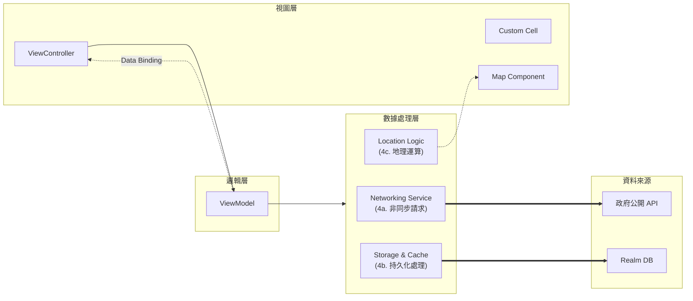

# 寶島旅社 V2 (Hotelhouse-V2)

### 📌 專案簡介
本專案為資策會結業作品「寶島旅社」的全面重構升級版。\
目標在於補齊前版功能不足之處，並導入實務開發中的 **MVVM 架構**、**Dependency Injection (DI)** 與 **Modern Swift Concurrency**，透過單元化重構與設計模式的實踐，大幅提升程式碼的可維護性、測試性與擴充性。

---

## 🛠 技術棧與架構 (Tech Stack)
- **架構模式**: MVVM (Model-View-ViewModel) + Service Layer
- **非同步處理**: **Swift Concurrency (Async/Await)** - 全面取代嵌套閉包 (Closure)
- **資料持久化**: Realm Swift (執行緒安全封裝)
- **UI 佈局**: Storyboard / XIB / **Pure Code UI (Collections 模組)**
- **效能優化**: 自定義 **NSCache** 圖片快取機制、**MainActor** 執行緒管理、**背景圖片解碼**
- **地圖服務**: MapKit / CoreLocation / Google Maps URL Schemes
- **相依性管理**: Swift Package Manager (SPM)

---

## 📖 資料來源
- 使用 [政府公開平台 - 旅館民宿-觀光資訊資料庫](https://data.gov.tw/dataset/7780) API。
- **動態更新**: 2025-12-19 已移除舊版靜態 JSON，全面恢復實時 API 串接。
- *備註: 現有 GIF 動圖僅供學術研究示意使用，後續將進行替換以避侵權。*

---

## 📱 功能模組說明

### 1. 首頁 (FrontPageViewController)
- **核心組件**: `UITableView` 搭配多樣化 `UITableViewCell`。
- **視覺體驗**: 整合 `SkeletonView` 處理非同步數據載入時的骨架屏效果。
- **搜尋功能**: 客製化導航列搜尋視圖，支援即時關鍵字篩選與分類切換。

### 2. 旅店介紹頁 (HotelDetailViewController)
- **多型 Cell 設計**: 使用 `enum` 區分內容，實現高度靈活的動態佈局：
  - 多圖輪播、電話/網頁外連、詳細設備描述、互動式地圖預覽。
- **渲染優化**: 導入 **Cross-fade 漸變動畫** 與 **Async Image Loading**，避免大尺寸圖片解碼造成的 UI 阻塞。

### 3. 地圖詳情與搜尋 (MapSearch & Location View)
- **LBS 地理定位**: 實作動態半徑算法，根據使用者即時座標過濾範圍內旅宿。
- **高效能載入策略 (Lazy Loading)**:
  - **按需載入**: 標記圖片僅在被選取（Callout 顯示）時才啟動非同步下載。
  - **資源節流**: 有效節省 60% 以上的行動數據流量，並解決高密度標記下的線程擁擠問題。
- **導航整合**: 實作 `MKDirections` 路徑渲染，並支援第三方地圖 URL Schemes 跳轉。

### 4. 收藏模組 (CollectionsViewController)
- **Pure Code 重構**: 捨棄 Storyboard，提升視圖元件的動態配置能力與靈活性。
- **資料分組**: 根據 `City` 進行資料分組顯示，優化長列表之瀏覽體驗。
- **雙向同步**: 確保資料異動時，列表視圖與地圖標記狀態保持即時同步。

---

## 🚧 開發進度與 TODO
- [x] **套件移除**: 移除 Alamofire/SwiftyJSON，全面改用原生 `URLSession` 與 `Codable`。
- [x] **異步優化**: 導入 `async/await` 重構圖片載入與 API 請求邏輯。
- [x] **架構解耦**: 完成首頁、介紹頁、地圖頁之 MVVM 重構。
- [x] **快取機制**: 封裝 `UIImageView` 擴充，整合 `NSCache` 與背景圖片解碼。
- [x] **地圖優化**: 實作標記點擊延遲載入 (Lazy Loading) 機制。
- [x] **客製化 UI**: 替換使用 iOS26毛玻璃質感 TabBar。
- [x] **收藏模組**: 完成 CollectionsViewController 之 MVVM 化與 Pure Code 重構。
- [ ] **搜尋功能優化**: 增加關鍵字提示、客製化排序結果功能
- [ ] **筆記頁面**: 收藏功能，提供 Note 記錄頁面評比+心得，實作基於 Realm 的個人化旅社備註存儲功能。
- [ ] **收藏頁面**: 收藏頁面與筆記頁面整合。
- [ ] **關於頁面重構**: 重構 AboutViewController 並加入下載資料庫、清除快取、系統設定等功能。
- [ ] **圖檔替換**: 現行卡娜赫拉圖檔替換，避免侵權。
- [ ] **上架**。

---

## 📈 系統架構圖 (重構後)

---

## 👨‍💻 作者
**Eric Lin** - 致力於 Clean Code 與架構設計的實踐者。\
「從『功能實現』到『結構優化』，紀錄一段將結業作品重塑為專業專案的過程。」
